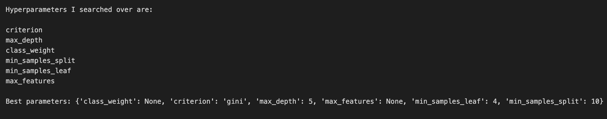
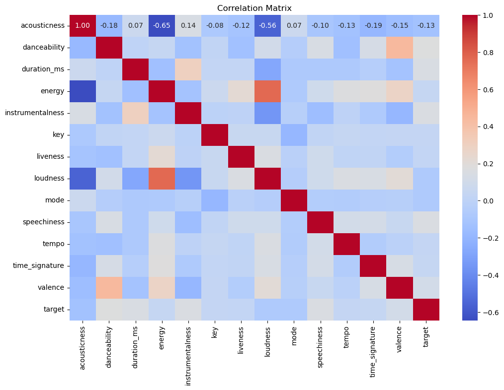
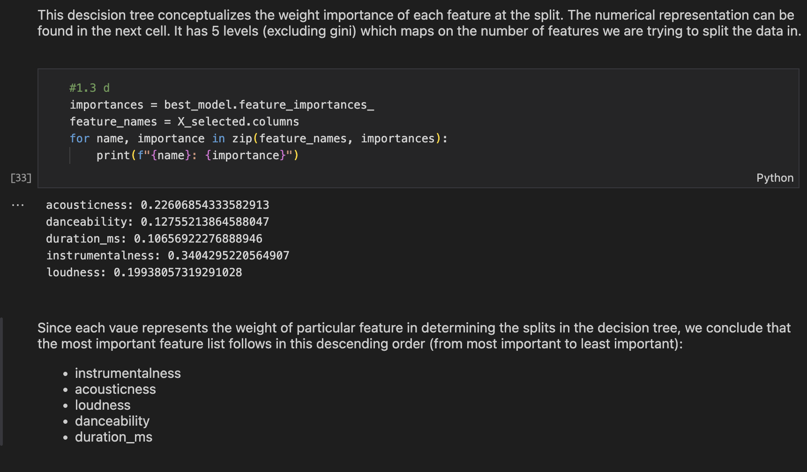
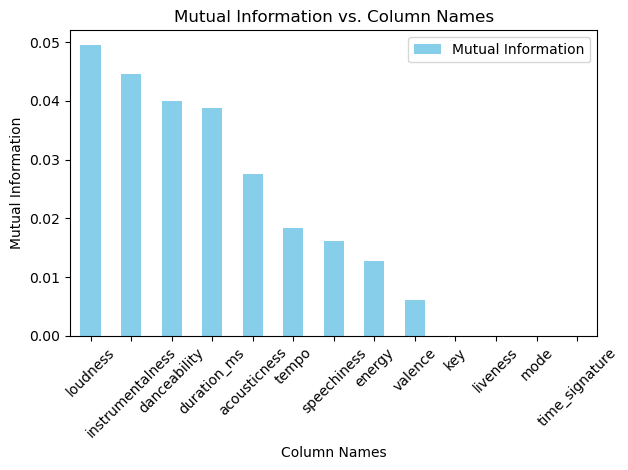
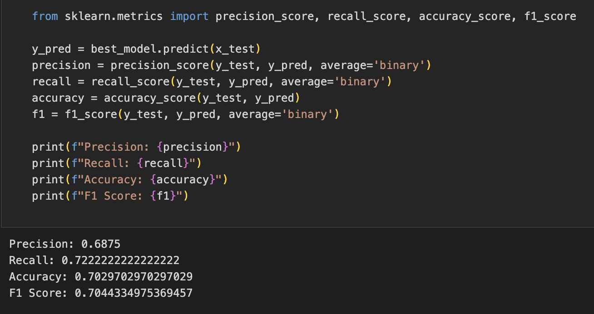

# Spotify Song Preference Decision Tree Classifier
## Overview

In this project, we implement a Decision Tree classifier using scikit-learn to predict whether an individual would like or dislike a song based on its features. The classifier is trained on a dataset of songs from Spotify, each with a set of features and an indication of the individual's preference.

## Dataset

The Spotify dataset comprises songs, each characterized by various features. The target variable indicates the individual's preference (like or dislike) for each song.

## Requirements

Python
scikit-learn
pandas
graphviz (for decision tree visualization)
## Implementation Steps

1. Data Import and Preprocessing
Imported data into a Pandas dataframe.
Examined and identified relevant features for classification.
Created a dataframe with selected features and a separate series for labels.
Split the dataset into 80% training and 20% testing sets.
2. Model Training
Performed hyper-parameter tuning using cross-validation (GridSearchCV) on parameters like 'criterion', 'max_depth', and 'class_weight'.
Trained the Decision Tree classifier with the best hyper-parameters.
3. Model Evaluation
Evaluated the model using metrics such as precision, recall, accuracy, and F1-score.
Generated a confusion matrix to visualize predictions.
Visualized the decision tree using graphviz.
4. Feature Importance Analysis
Analyzed the relative importance of each feature in the decision tree.
Compared the quantitative importance with initial qualitative estimates.

## Usage

Instructions on how to run the notebook and reproduce the results.

## Results and Discussion

### Best Hyperparameters for Decision Tree
# 
### Correlation Matrix of the features
# 
### Decision Tree 
# decisionTree](outcome/decisionTree.pdf)
### Importance of the Features
# 
### Mutual Information 
# 
### Precision,Recall,Accuracy,F1-score 
# 

## Conclusion

Summarize the findings and potential future work or improvements.

