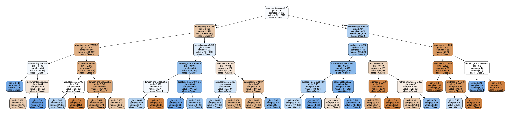
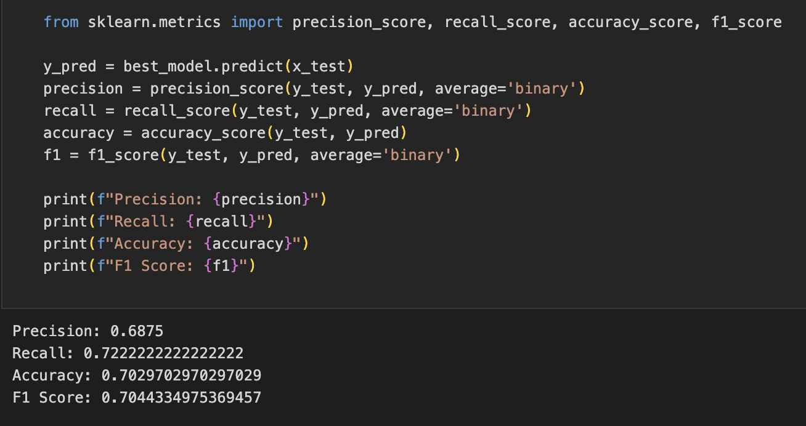

# Spotify Song Preference Decision Tree Classifier
## Overview

In this project, we implement a Decision Tree classifier using scikit-learn to predict whether an individual would like or dislike a song based on its features. The classifier is trained on a dataset of songs from Spotify, each with a set of features and an indication of the individual's preference.

## Dataset

The Spotify dataset comprises songs, each characterized by various features. The target variable indicates the individual's preference (like or dislike) for each song.

## Requirements

Python
scikit-learn
pandas
graphviz (for decision tree visualization)
## Implementation Steps

1. Data Import and Preprocessing
Imported data into a Pandas dataframe.
Examined and identified relevant features for classification.
Created a dataframe with selected features and a separate series for labels.
Split the dataset into 80% training and 20% testing sets.
2. Model Training
Performed hyper-parameter tuning using cross-validation (GridSearchCV) on parameters like 'criterion', 'max_depth', and 'class_weight'.
Trained the Decision Tree classifier with the best hyper-parameters.
3. Model Evaluation
Evaluated the model using metrics such as precision, recall, accuracy, and F1-score.
Generated a confusion matrix to visualize predictions.
Visualized the decision tree using graphviz.
4. Feature Importance Analysis
Analyzed the relative importance of each feature in the decision tree.
Compared the quantitative importance with initial qualitative estimates.

## Usage

Run Q1!.ipynb file 

## Results and Discussion

### Correlation Matrix of the features
# 

### Mutual Information 
# 
Based on the Mutual Information, the most relevant features are (in descending order):
- loudness
- dancability
- duration_m
- instrumentalness 
- acousticness

### Best Hyperparameters for Decision Tree
# 

### Decision Tree 
# 
This descision tree conceptualizes the weight importance of each feature at the split. It has 5 levels (excluding gini) which maps on the number of features we are trying to split the data in.

### Importance of the Features
# 

### Precision,Recall,Accuracy,F1-score 
# 

## Conclusion

The comparison between qualitative estimates from mutual information and decision tree feature importance reveals significant differences. It's essential to recognize that these disparities arise from the use of distinct metrics to evaluate feature relevance. Mutual information quantifies the reduction in uncertainty about the target variable when a feature is known, whereas decision tree feature importance calculates the weighted average reduction in a chosen criterion attributable to a feature across all tree nodes where it's used for splitting. Furthermore, it's crucial to understand that feature importances in decision trees are inherently tied to the model's structure. A feature positioned higher in the tree wields greater influence on subsequent splits, thus accruing more importance in the decision tree model, even if its mutual information value isn't the highest.

